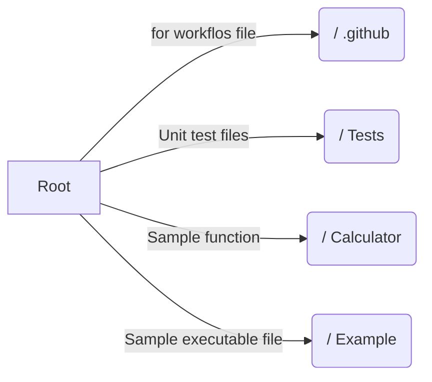

# Simple Unittest based on Python

Hi! This project is created to show a simple unit test project based on Python language and run that by Github workflows.

Can see workflows and processes in the **Action** tab on the top of this screen or  [this](https://github.com/mohammad26845/unit_test_sample/actions) link.

## bag

Explain directory structure

 

